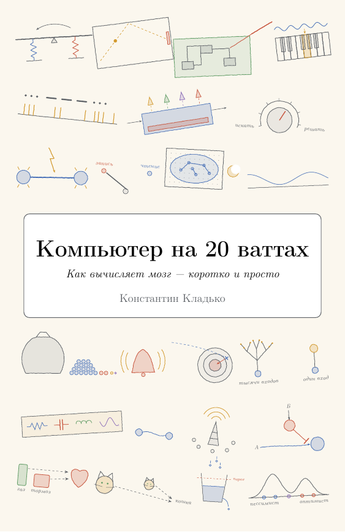
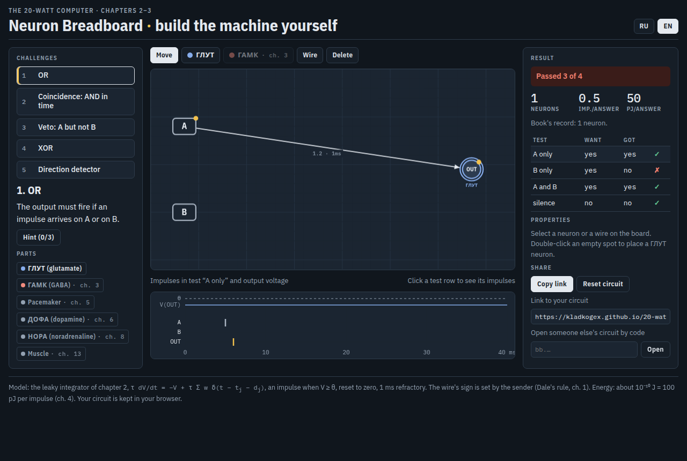
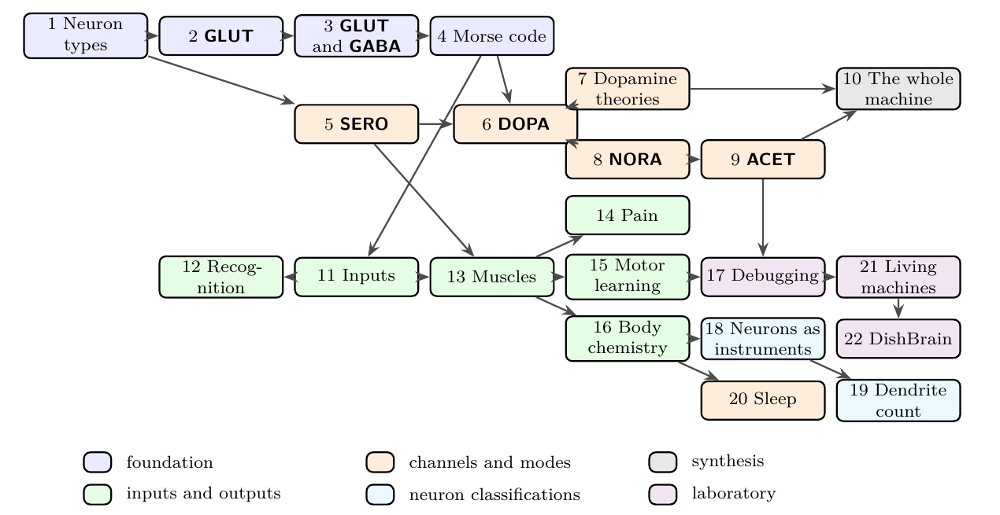

<div align="center">



# The 20-Watt Computer

### How the brain computes: a quantitative approach for engineers

**86 billion processors. About 20 watts. No backprop wires. No datasheet — until now.**

[](https://kladkogex.github.io/20-watt-computer/read/00.html)
[](https://kladkogex.github.io/20-watt-computer/pdf/20-watt-computer-ru.pdf)
[](https://kladkogex.github.io/20-watt-computer/pdf/20-watt-computer-ru-paperback.pdf)
[](https://kladkogex.github.io/20-watt-computer/breadboard/)
[](https://kladkogex.github.io/20-watt-computer/)

[](https://doi.org/10.5281/zenodo.22984941)
[](LICENSE)
[](LICENSE)


**Read it in:** 🇬🇧 [English](https://kladkogex.github.io/20-watt-computer/pdf/20-watt-computer-en.pdf) · 🇨🇳 [中文](https://kladkogex.github.io/20-watt-computer/pdf/20-watt-computer-zh.pdf) · 🇯🇵 [日本語](https://kladkogex.github.io/20-watt-computer/pdf/20-watt-computer-ja.pdf) · 🇰🇷 [한국어](https://kladkogex.github.io/20-watt-computer/pdf/20-watt-computer-ko.pdf) · 🇪🇸 [Español](https://kladkogex.github.io/20-watt-computer/pdf/20-watt-computer-es.pdf) · 🇧🇷 [Português](https://kladkogex.github.io/20-watt-computer/pdf/20-watt-computer-pt.pdf) · 🇷🇺 [Русский](https://kladkogex.github.io/20-watt-computer/pdf/20-watt-computer-ru.pdf) · 🇺🇦 [Українська](https://kladkogex.github.io/20-watt-computer/pdf/20-watt-computer-uk.pdf). Each edition also has a pocket-size paperback.

</div>

---

A single AI accelerator draws about 700 W. The machine reading this sentence runs on 20. This free textbook explains how, in the language you already speak: **circuits, signals, codes, control loops, learning rules and energy budgets.** It has no history lessons and no anatomy tours, just the machine.

Neurons are typed the way an engineer types a part, by what they put on the wire. **GLUT** (glutamate) is the data bus. **GABA** (GABA) is flow control. **DOPA** (dopamine), **SERO** (serotonin), **NORA** (noradrenaline) and **ACET** (acetylcholine) are broadcast control registers. Every number in the book comes from a small Python program you can run and change. Every major claim is traced to the experiment behind it.


## Things you will be able to prove

A few of the book's results, each derived in the text and checked with a model:

- **A network of excitatory neurons alone can only compute monotone functions.** Add inhibition and it computes *any* Boolean function, one wire per bit.
- **Energy sets the code.** The power budget limits a neuron to roughly one spike per second on average. So the brain's language is sparse and spends its spikes on *news*: what changed, or what wasn't predicted.
- **Averaging many noisy neurons stops helping fast.** With correlated noise (c = 0.1), pooling cuts the error at most about 3×. A few dozen neurons already get you there.
- **Dopamine does gradient descent with no backward wires.** A broadcast reward-prediction error plus a local eligibility trace follows the gradient on average. The price is that learning time grows with the number of neurons, so broadcast learning suits small circuits that choose between a few options.
- **Acetylcholine is a Kalman gain.** In the optimal filter, the weight given to new input and the learning rate are the same quantity. So one broadcast signal can set both.
- **Your hormone system can't be more precise than about 10%.** A three-stage cascade with proportional feedback is stable only for loop gain K < 8.
- **A brain–computer interface can steer movement while hearing a tiny fraction of the neurons**, because population activity is low-dimensional and its noise is shared. A few hundred neurons carry almost all the common variables. For the same reason, you only get a few bits per second out.
- **How a dish of neurons "learns" Pong (DishBrain).** Shake the network on a miss and leave it alone on a hit, and it drifts toward settings that miss less. No reward signal is needed. Chapter 22 specifies the rig in enough detail to rebuild it.

## Play with it



**[Neuron breadboard](https://kladkogex.github.io/20-watt-computer/breadboard/)** runs in the browser: 13 challenges across chapters 2–18. Logic and timing from GLUT/GABA, a SERO pacemaker NOR, dopamine three-factor learning, NORA gain, an onset detector, shift-invariant object recognition, a muscle grip and a frequency divider. It scores you in neurons, spikes and picojoules per answer, gives hints, and can show the book's solution.

## What's inside



**22 chapters · ~160 exercises with answers · ~370 checked references · 10 runnable models · an experimental supplement with a source for every major claim**

| Part | Chapters |
|---|---|
| **Foundations** | 1 Neuron types · 2 What GLUT neurons compute · 3 GLUT and GABA together · 4 Morse code: the language of neurons |
| **Broadcast channels** | 5 What SERO neurons compute · 6 Networks that learn: adding DOPA · 7 Alternative theories of dopamine learning · 8 When to search and when to decide: NORA · 9 When to write and when to read: ACET · 10 The whole machine |
| **Inputs and outputs** | 11 Eyes, ears and other sensors · 12 Image and video recognition · 13 How the brain controls muscles · 14 Pain: the alarm signal · 15 How the machine learns to move · 16 The second output: body chemistry |
| **The lab** | 17 Debugging the machine · 18 Neuron types by electrical function · 19 Neurons by number of dendrites · 20 What neurons do during sleep · 21 Machines made of living neurons · 22 DishBrain |

### Pick your path

| You are… | Read |
|---|---|
| an ML engineer who wants to know how the brain learns | 1–4, 6–9, 12, 15 (skim 5, 11, 13) |
| a hardware / neuromorphic designer | 1–5, 11, 13, 16–19 (skim 9, 15) |
| building brain–computer interfaces or living-neuron chips | 1, 2, 4, 11, 13, 17, 21, 22 |
| an engineer with one weekend | 1, 2, 3, 6, 10 |

**[Read it online](https://kladkogex.github.io/20-watt-computer/read/00.html):** every chapter is a web page with a «Коротко / Полностью» switch between the short version and the full one. The short version has no formulas and has colour-pencil drawings. The full one has formulas, models and exercises, and each exercise's answer is one click away. There is also a **paperback PDF** of the short version.

## Run the models

```bash
git clone https://github.com/kladkogex/20-watt-computer.git
cd 20-watt-computer
python3 models/dofa_learning.py      # dopamine as a reward-prediction error, and when it locks in
python3 models/dishbrain_model.py    # "noise on a miss" teaches Pong without a reward
make models                          # regenerate every data file behind the figures
```

## Build the book

Requires Docker (uses the `texlive/texlive` image).

    make ru            # the full Russian PDF
    make ru-paperback  # the pocket-size edition (one short chapter per full chapter)
    make models        # regenerate simulation data in figures/ (acet_memory.py needs numpy)

**Layout**

- `ru/`, `en/`: one folder per language, `main.tex` + `chapters/`; `ru/paperback/` holds the pocket edition
- `figures/`: shared TikZ icons and data files used by every edition
- `models/`: the Python models behind the book's figures and numbers
- `site/`: the website and the breadboard; `site/web/` converts both editions to HTML with make4ht (`bash site/web/build.sh`)
- `ru/solutions/`: full instructor solutions, a submodule pointing to a private repository. It isn't needed to build the book; instructors can ask the author for access.

## About the author

**Konstantin (Stan) Kladko** is a physicist and engineer, co-founder of [SKALE](https://skale.space/). He began in theoretical physics, working on the nonlinear dynamics of lattices (e.g. Flach, Kladko & MacKay, *Phys. Rev. Lett.* **78**, 1207, 1997). Papers: [Google Scholar](https://scholar.google.com/citations?user=QfrvKTMAAAAJ) · [author page](https://kladkogex.github.io/20-watt-computer/author/).

## Contribute

Found a claim that doesn't match its source, a number that doesn't match its model, or an exercise that's wrong? [Open an issue](https://github.com/kladkogex/20-watt-computer/issues). Accuracy is the point of this book. Translations are welcome under the same license.

## License

Book text, figures, exercises and PDFs: [CC BY-NC-SA 4.0](https://creativecommons.org/licenses/by-nc-sa/4.0/). You're free to share, teach with and translate them for non-commercial use, with credit and under the same license.
Code (models, build scripts, breadboard): MIT. See [LICENSE](LICENSE).

© 2026 Konstantin Kladko · Cite as: Kladko, K. (2026). *The 20-Watt Computer: How the Brain Computes.* Zenodo. https://doi.org/10.5281/zenodo.22984941
